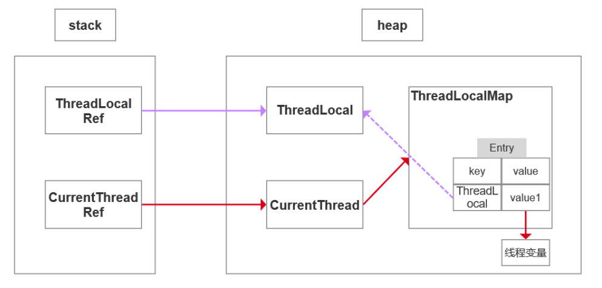
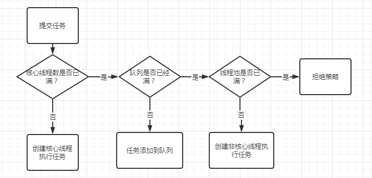

### 线程的生命周期

---

- 线程通常有五种状态:创建，就绪，运行、阻塞和死亡

- 阻塞的情况又分为三种
  
    - 等待阻塞：运行的线程执行wait方法，该线程会释放占用的所有资源，JVM会把该线程放入“等待池”中。进入这个状态后，是不能自动唤醒的，必须依靠其他线程调用notify或notifyAll方法才能被唤醒，wait是Object类的方法

    - 同步阻塞：运行的线程在获取对象的同步锁时，若该同步锁被别的线程占用，则JVM会把该线程放入“锁池”中

    - 其他阻塞：运行的线程执行sleep或join方法，或者发出了I/O请求时，JVM会把该线程置为阻塞状态。当sleep状态超时、join等待线程终止或者超时、或者I/O处理完毕时，线程重新转入就绪状态。sleep是Thread类的方法

### sleep()、wait()、join()、yield()的区别

---

- 锁池

所有需要竞争同步锁的线程都会放在锁池当中，当前对象的锁已经被其中一个线程得到，则其他线程需要在这个锁池进行等待，当前面的线程释放同步锁后锁池中的线程去竞争同步锁，当某个线程得到后会进入就绪队列进行等待cpu资源分配

- 等待池

当调用wait()方法后，线程会放到等待池当中，等待池的线程是不会去竞争同步锁。只有调用了notify()或notifyAll()后等待池的线程才会开始去竞争锁，notify()是随机从等待池选出一个线程放到锁池，而notifyAll()是将等待池的所有线程放到锁池当中

- sleep vs wait
  
  - sleep是Thread方法，wait则是Object方法
  
  - sleep方法不会释放lock，但是wait会释放
  
  - sleep方法不依赖于同步器synchronized，但是wait需要依赖synchronized

  - sleep不需要被唤醒，但是wait需要
  
  - sleep一般用于当前线程休眠，或者轮循暂停操作，wait则多用于多线程之间的通信
  
- yield

yield()执行后线程直接进入就绪状态，马上释放了cpu的执行权，但是依然保留了cpu的执行资格，所以有可能cpu下次进行线程调度还会让这个线程获取到执行权继续执行

- join

join()执行后线程进入阻塞状态，例如在线程B中调用线程A的join()，那线程B会进入到阻塞队列，直到线程A结束或中断线程

```java
    // 111
    // 222
    public static void main(String[] args) {
        Thread thread = new Thread(() -> {
            try {
                Thread.sleep(3000);
                System.out.println(111);
            } catch (InterruptedException e) {
                e.printStackTrace();
            }
        });
        thread.start();
        try {
            // 在主线程中执行thread的join()方法，必须要等到thread结束后，才会执行主线程的方法
            thread.join();
        } catch (InterruptedException e) {
            e.printStackTrace();
        }
        System.out.println(222);
    }

```

### Thread、Runable的区别

---

Thread和Runnable的实质是继承关系，没有可比性。无论使用Runnable还是Thread，都会new Thread，然后执行start()

### 守护线程

---

当 JVM 中不存在任何一个正在运行的非守护线程时，则 JVM 进程即会退出


可以看到因为有一个非守护线程一直在后台运行着，JVM 无法正常退出。那么，如果说正在运行的是个守护线程，结果又会怎么样呢


可以看到，当主线程退出时，JVM 会随之退出运行，守护线程同时也会被回收，即使你里面是个死循环也不碍事

JVM 中的垃圾回收线程就是典型的守护线程，如果说不具备该特性，会发生什么呢

当 JVM 要退出时，由于垃圾回收线程还在运行着，导致程序无法退出

通常来说，守护线程经常被用来执行一些后台任务，但是呢，你又希望在程序退出时，或者说 JVM 退出时，线程能够自动关闭，此时，守护线程是你的首选

### ThreadLocal

---

- 每一个Thread对象均含有一个ThreadLocalMap类型的成员变量threadLocals，threadLocals存储本线程中**所有**ThreadLocal对象及其对应的值

- ThreadLocalMap由一个个Entry对象构成(Entry数组)

- Entry继承自WeakReference<ThreadLocal<?>>，一个Entry由ThreadLocal对象和Object构成。Entry的key是ThreadLocal对象，并且是一个弱引用。当没指向key的强引用后，该key就会被垃圾收集器回收

- 当执行set方法时，ThreadLocal首先会获取当前线程对象，然后获取当前线程的ThreadLocalMap对象。再以当前ThreadLocal对象为key，将值存储进ThreadLocalMap对象中。
  
- 当执行get方法时，ThreadLocal首先会获取当前线程对象，然后获取当前线程的ThreadLocalMap对象。再以当前ThreadLocal对象为key，获取对应的value。

- 由于每一条线程均含有各自私有的ThreadLocalMap容器，这些容器相互独立互不影响，因此不会存在线程安全性问题，从而也无需使用同步机制来保证多条线程访问容器的互斥性。

- 使用场景

  - Java的Web项目大部分都是基于Tomcat，每次访问都是一个新的线程，每一个线程都独享一个ThreadLocal，在接收请求的时候set特定内容，在需要的时候get这个值
  
  - 进行事务操作，用于存储线程事务信息
  
  - 数据库连接，Session会话管理
  
    - Spring在事务开始时会给当前线程绑定一个Jdbc Connection,整个事务过程都是使用该线程绑定的connection来执行数据库操作，实现了事务的隔离性,用的ThreadLocal来实现这种隔离



### ThreadLocal内存泄露

--- 

- 强引用：使用最普遍的引用(new)或者反射创建对象，一个对象具有强引用，不会被垃圾回收器回收。当内存空间不足，JVM宁愿抛出OutOfMemoryError错误，使程序异常终止，也不回收这种对象。

  - 如果想取消强引用和某个对象之间的关联，可以显式地将引用赋值为null，这样可以使JVM在合适的时间就会回收该对象

- 弱引用：JVM进行垃圾回收时，无论内存是否充足，都会回收被弱引用关联的对象。在java中，用java.lang.ref.WeakReference类来表示

- ThreadLocal的实现原理：每一个Thread维护一个ThreadLocalMap，key为使用弱引用的ThreadLocal实例，value为线程变量的副本

- ThreadLocalMap使用ThreadLocal的弱引用作为key，如果一个ThreadLocal不存在外部强引用时(ThreadLocalRef与ThreadLocal断开)，Key(ThreadLocal)势必会被GC回收，这样就会导致ThreadLocalMap中key为null， 而value还存在着强引用，只有thead线程结束(或者调用ThreadLocal的get()、set()、remove()),value的强引用链条才会断掉，但如果当前线程不结束或者不调用那些方法的话，这些key为null的Entry的value就会一直存在一条强引用链（红色链条）

  - 假如key是强引用：当ThreadLocalMap的key为强引用，并且ThreadLocalRef与ThreadLocal断开，回收ThreadLocal时，因为ThreadLocalMap还持有ThreadLocal的强引用，如果没有手动删除，ThreadLocal不会被回收（那么就存在红色链条），导致Entry内存泄漏

  - 所以key是弱引用：当ThreadLocalMap的key为弱引用回收ThreadLocal时，由于ThreadLocalMap持有ThreadLocal的弱引用，即使没有手动删除，ThreadLocal也会被回收，此时key为null，在下一次ThreadLocalMap调用set(),get()，remove()方法的时候会被清除value值

- ThreadLocal内存泄漏的根源：由于ThreadLocalMap的生命周期跟Thread一样长，如果没有手动删除对应key就会导致内存泄漏，而不是因为弱引用

- 每次使用完ThreadLocal都调用它的remove()方法清除数据

### 并发的三大特性

--- 

- 原子性

  - 自增操作，它本身其实并不是原子性操作，分了3步的，包括读取变量的原始值、进行加1操作、写入工作内存。所以在多线程中，有可能一个线程还没自增完，另一个线程就已经读取了值，导致结果错误。那如果我们能保证自增操作是一个原子性的操作么就能保证其他线程读取到的一定是自增后的数据

  - 关键字：synchronized
  
```java
    private long count = 0;
    //1：将 count 从主存读到工作内存中的副本中
    //2：+1的运算
    //3：将结果写入工作内存
    //4：将工作内存的值刷回主存(什么时候刷入由操作系统决定，不确定的)
    public void calc() {
        count++;
    }
```

  
- 可见性

  - 当多个线程访问同一个变量时，一个线程修改了这个变量的值，其他线程能够立即看得到修改的值
  
  - 若两个线程在不同的cpu，那么线程1改变了i的值还没刷新到主存，线程2又使用了i，那么这个i值肯定还是之前的，线程1对变量的修改线程没看到这就是可见性问题

  - 关键字：volatile、synchronized、final
  
```java
    // 线程1
    boolean stop = false;
    // 如果线程2改变了stop的值，线程1不一定会停止
    while (!stop) {
        doSomething();
    }
    // 线程2
    stop = true;
```

- 有序性

  - 有些代码进行重排序之后，虽然对变量的值没有造成影响，但有可能会出现线程安全问题
  
  - 关键字：volatile、synchronized(volatile本身就包含了禁止指令重排序的语义，而synchronized关键字是由“一个变量在同一时刻只允许一条线程对其进行lock操作”这条规则明确的)

```java
    int a = 0;
    boolean flag = false;

    public void write() {
        a = 2; // 1
        flag = true; // 2
    }
    // write方法里的1和2做了重排序，线程1先对flag赋值为true，随后执行到线程2，ret直接计算出结果，再到线程1，这时候a才赋值为2,很明显迟了一步
    public void multiply() {
        if (flag) { // 3
            int ret = a * a; // 4
        }
    }
```

synchronized关键字同时满足以上三种特性，但是volatile关键字不满足原子性

在某些情况下，volatile的同步机制的性能确实要优于锁(使用synchronized关键字或java.util.concurrent包里面的锁)，因为volatile的总开销要比锁低

我们判断使用volatile还是加锁的唯一依据就是volatile的语义能否满足使用的场景(原子性)

### volatile

--- 

- 保证被volatile修饰的共享变量对所有线程总是可见的

- 禁止指令重排序优化

- inc++不是原子性操作，所以不能用volatile保证线程安全

### 线程池

--- 

线程池好处

- 降低资源消耗；提高线程利用率，降低创建和销毁线程的消耗

- 提高响应速度；任务来了，直接有线程可用可执行，而不是先创建线程，再执行

- 提高线程的可管理性；线程是稀缺资源，使用线程池可以统一分配调优监控

线程池参数

- corePoolSize代表核心线程数，这些线程创建后并不会消除，而是一种常驻线程

- maxinumPoolSize代表的是最大线程数

- keepAliveTime、unit表示超出核心线程数之外的线程的空闲存活时间

- workQueue用来存放待执行的任务，假设我们现在核心线程都已被使用，还有任务进来则全部放入队列，直到整个队列被放满，如果任务还进入则会开始创建新的线程

- ThreadFactory是一个线程工厂，用来生产线程执行任务。我们可以选择使用默认的创建工厂，产生的线程都在同一个组内，拥有相同的优先级，且都不是守护线程

- Handler任务拒绝策略，有两种情况:第一种是调用shutdown等方法关闭线程池后，这时候即使线程池内部还有没执行完的任务正在执行，但是由于线程池已经关闭，线程池提交任务就会遭到拒绝。另一种情况就是当达到最大线程数，线程池已经没有能力继续处理新提交的任务时，这是也就拒绝

### 线程池流程

---



### Queue

---

Collection下有三个子接口：List、Set、Queue

Queue继承collection接口：

- Deque接口(双端队列) extends Queue< E >
  - LinkedList
- BlockingQueue接口(阻塞队列) extends BlockingQueue< E >, Deque< E >
  - PriorityBlockingQueue
  - LinkedBlockingQueue
  - ArrayBlockingQueue
- AbstractQueue接口(非阻塞队列) extends AbstractCollection< E > implements Queue< E >
  - ConcurrentLinkedQueue
  - PriorityQueue
  
一个接口可以继承多个接口;一个类可以实现多个接口;一个类只能继承一个类

区别：

- 阻塞队列当队列为空的时候获取元素将会被阻塞；非阻塞队列为空的话，再从队列取出数据就直接返回null

- 阻塞队列当队列满了的话再插入数据就会被阻塞，直到队列不满

- 支持阻塞的插入方法：当队列满时，队列会阻塞插入元素的线程，直到队列不满。
  
- 支持阻塞的移除方法：队列为空时，获取元素的线程会等待队列变为非空

- 非阻塞队列想要阻塞只能手动使用wait()和notify()

### 线程池中阻塞队列

---

- 一般的队列只能保证作为一个有限长度的缓冲区，如果超出了缓冲长度，就无法保留之后的任务了，阻塞队列通过阻塞可以保留住当前想要继续入队的任务

- 阻塞队列可以保证队列中没有任务时阻塞获取任务的线程，使得线程进入wait状态，释放cpu资源

- 阻塞队列自带阻塞和唤醒的功能，不需要额外处理，无任务执行时(队列空),线程池利用阻塞队列的take方法(取首元素，取不到则阻塞)挂起，从而维持核心线程的存活、不至于一直占用cpu资源

### 为什么是先添加列队而不是创建最大线程

---

在创建新线程的时候，是要获取全局锁的，这个时候其它的就得阻塞，影响了整体效率

### 线程复用原理

---

在线程池中，通过同一个线程去执行不同的任务，这就是线程复用。

假设现在有100个任务，创建一个固定线程的线程池（FixedThreadPool），核心线程数和最大线程数都是3，那么当这个100个任务执行完，都只会使用三个线程。

```java
public class FixedThreadPoolDemo {

  static ExecutorService executorService = Executors.newFixedThreadPool(3);

  public static void main(String[] args) {
    for (int i = 0; i < 100; i++) {
      executorService.execute(() -> {
        System.out.println(Thread.currentThread().getName() + "-> 执行");
      });
    }
    // 关闭线程池
    executorService.shutdown();
  }
}
```

执行结果:

```java
pool-1-thread-1-> 执行
pool-1-thread-2-> 执行
pool-1-thread-3-> 执行
pool-1-thread-1-> 执行
pool-1-thread-3-> 执行
pool-1-thread-2-> 执行
pool-1-thread-3-> 执行
pool-1-thread-1-> 执行
...
```

- 线程复用的原理

  - 线程池将线程和任务进行解耦，线程是线程，任务是任务，摆脱了之前通过Thread创建线程时的一个线程必须对应一个任务的限制

  - 在线程池中，同一个线程可以从阻塞队列中不断获取新任务来执行，其核心原理在于线程池对Thread进行了封装，并不是每次执行任务都会调用Thread.start()来创建新线程，而是让每个线程去执行一个“循环任务”，在这个“循环任务”中不停的检查是否有任务需要被执行，如果有则直接执行，也就是调用任务中的run方法，将run方法当成一个普通的方法执行

- ThreadPoolExecutor源码

```java
    public void execute(Runnable command) {
        // 如果传入的Runnable的空，就抛出异常
        if (command == null)
            throw new NullPointerException();
        // 拿到当前线程池的线程个数
        int c = ctl.get();
        // 线程池中的线程比核心线程数少 
        if (workerCountOf(c) < corePoolSize) {
            // 新建一个核心线程执行任务
            if (addWorker(command, true))
                return;
            c = ctl.get();
        }
        // 核心线程已满，但是任务队列未满，添加到队列中
        // isRunning是判断线程个数是否小于最大线程数，offer是判断能加入到队列中
        if (isRunning(c) && workQueue.offer(command)) {
            int recheck = ctl.get();
            // 任务成功添加到队列以后，再次检查线程数超过了最大线程数
            if (!isRunning(recheck) && remove(command))
                // 如果线程池中的线程数超过了最大线程数(线程池被关闭)，超过则把当前的任务从队列中移除，并拒绝该任务
                reject(command);
            else if (workerCountOf(recheck) == 0)
                addWorker(null, false);
        }
        else if (!addWorker(command, false)) // 核心线程池已满，队列已满，尝试创建一个非核心新的线程
            // 如果创建新线程失败，说明线程池关闭或者线程池满了，拒绝任务
            reject(command);
    }
```

```java
 final void runWorker(Worker w) {
        Thread wt = Thread.currentThread();
        Runnable task = w.firstTask;
        w.firstTask = null;
        w.unlock(); // 释放锁 设置work的state=0 允许中断
        boolean completedAbruptly = true;
        try {
            //一直执行 如果task不为空 或者 从队列中获取的task不为空
            while (task != null || (task = getTask()) != null) {
                    task.run();//执行task中的run方法
                }
            }
            completedAbruptly = false;
        } finally {
            //1.将 worker 从数组 workers 里删除掉
            //2.根据布尔值 allowCoreThreadTimeOut 来决定是否补充新的 Worker 进数组 workers
            processWorkerExit(w, completedAbruptly);
        }
    }
```

- 通过获取Worker的firstTask或者通过getTask方法从workQueue中获取待执行的任务

- 直接通过task.run()来执行具体的任务（而不是新建线程）

### Executors创建线程池

---

- newFiexedThreadPool(int Threads)：创建固定数目线程的线程池

- newCachedThreadPool()：创建一个线程池，如果线程池中的线程数量过大，它可以有效的回收多余的线程，如果线程数不足，那么它可以创建新的线程

- newSingleThreadExecutor()创建一个单线程的Executor

- newScheduledThreadPool(int corePoolSize)创建一个支持定时及周期性的任务执行的线程池，多数情况下可用来替代Timer类

不建议使用Executors创建线程池

```java
public class ExecutorsDemo {
    private static ExecutorService executor = Executors.newFixedThreadPool(15);
    public static void main(String[] args) {
        for (int i = 0; i < Integer.MAX_VALUE; i++) {
            executor.execute(new SubThread());
        }
    }
}
 
class SubThread implements Runnable {
    @Override
    public void run() {
        try {
            Thread.sleep(10000);
        } catch (InterruptedException e) {
            //do nothing
        }
    }
}
```
通过指定JVM参数：-Xmx8m -Xms8m 运行以上代码，会抛出OOM

```java
Exception in thread "main" java.lang.OutOfMemoryError: GC overhead limit exceeded
    at java.util.concurrent.LinkedBlockingQueue.offer(LinkedBlockingQueue.java:416)
    at java.util.concurrent.ThreadPoolExecutor.execute(ThreadPoolExecutor.java:1371)
    at com.hollis.ExecutorsDemo.main(ExecutorsDemo.java:16)
```

Executors底层是通过LinkedBlockingQueue实现的

```java
public static ExecutorService newFixedThreadPool(int nThreads) {
        return new ThreadPoolExecutor(nThreads, nThreads,
                                      0L, TimeUnit.MILLISECONDS,
                                      new LinkedBlockingQueue<Runnable>());
```

Java中的BlockingQueue主要有两种实现，分别是ArrayBlockingQueue 和 LinkedBlockingQueue

ArrayBlockingQueue是一个用数组实现的有界阻塞队列，必须设置容量

LinkedBlockingQueue是一个用链表实现的有界阻塞队列，容量可以选择进行设置，不设置的话，将是一个无边界的阻塞队列，最大长度为Integer.MAX_VALUE

对于一个无边界队列来说，是可以不断的向队列中加入任务的，这种情况下就有可能因为任务过多而导致内存溢出问题

- 创建线程池的正确姿势

```java

private static ExecutorService executor = new ThreadPoolExecutor(10, 10,
        60L, TimeUnit.SECONDS,
        new ArrayBlockingQueue(10));
```

提交的线程数超过当前可用线程数时，就会抛出java.util.concurrent.RejectedExecutionException，Exception总比发生Error要好

### SimpleDateFormat线程不安全

---

在多线程环境下，当多个线程同时使用相同的SimpleDateFormat对象（如static修饰）的话，如调用format方法时，多个线程会同时调用calender.setTime方法，导致time被别的线程修改，因此线程是不安全的

1、将SimpleDateFormat定义成方法内部变量

2、加一把线程同步锁：synchronized(lock)

3、使用ThreadLocal，每个线程都拥有自己的SimpleDateFormat对象副本

```java
/**
 * 使用ThreadLocal解决SimpleDateFormat线程不安全问题
 */
private static final ThreadLocal<SimpleDateFormat> LOCAL = new ThreadLocal<SimpleDateFormat>() {
      @Override
      protected SimpleDateFormat initialValue() {
              return new SimpleDateFormat("yyyyMMddHHmmss");
      }
};

LOCAL.get().parse(time);
LOCAL.remove();
```
