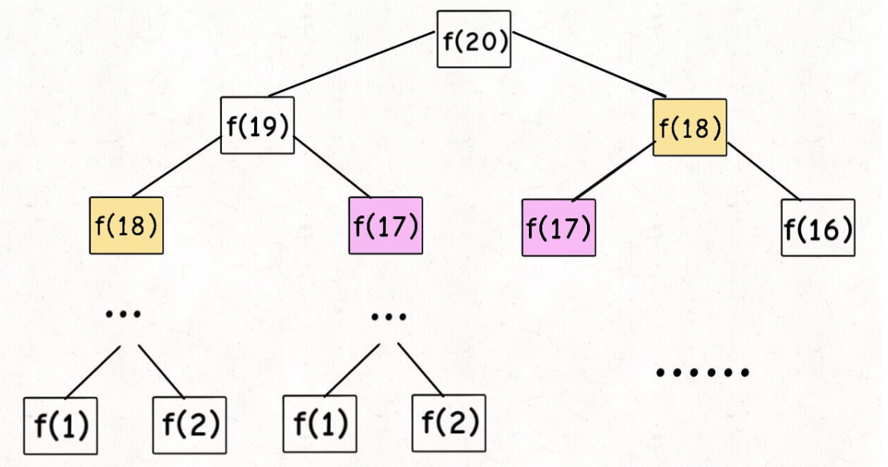
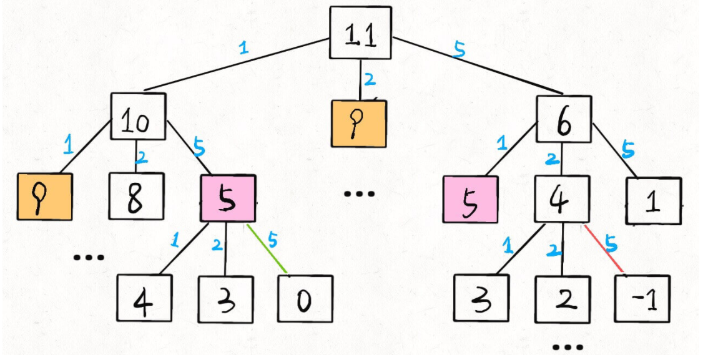
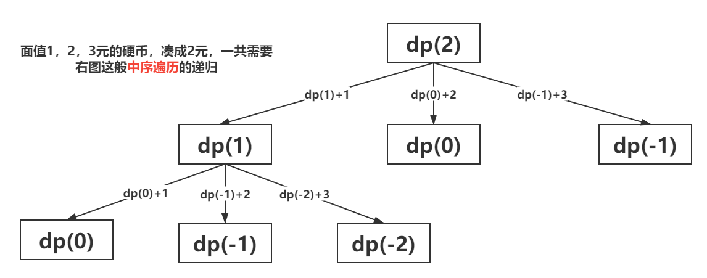
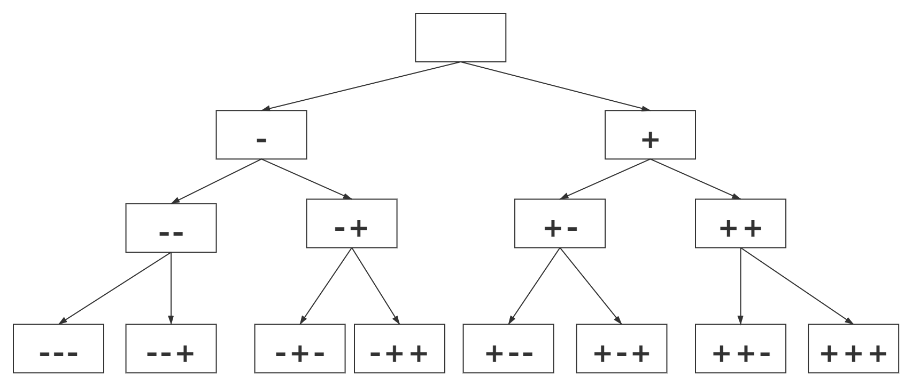
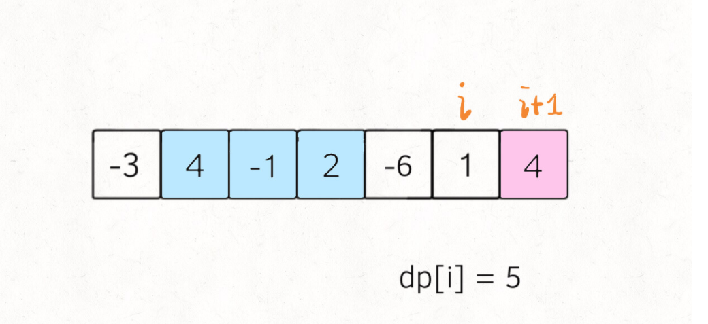

### 斐波那契数列

- 递归

```java
int fib(int n) {
    if (n == 1 || n == 2) return 1;
    return fib(n - 1) + fib(n - 2);
}
```



递归调用次数，即递归树中节点的总数，时间为O(2^n)

函数只有 `f(n - 1) + f(n - 2)` 一个加法操作，时间为 O(1)

时间复杂度为二者相乘，即 O(2^n)

- 带备忘录的递归

```java
public int fib(int n) {
    // 备忘录全初始化为 0
    int[] memo = new int[n + 1];
    // 进行带备忘录的递归
    return dfs(memo, n);
}

private int dfs(int[] memo, int n) {
    // base case
    if (n == 0 || n == 1) return n;
    // 已经计算过，不用再计算了
    if (memo[n] != 0) return memo[n];
    memo[n] = dfs(memo, n - 1) + dfs(memo, n - 2);
    return memo[n];
}
```

本算法不存在冗余计算，子问题就是 `f(1)`, `f(2)`, `f(3)` ... `f(20)`，所以子问题个数为 O(n)

函数本身时间为 O(1)

本算法的时间复杂度是 O(n)

- 自底向上

```java
public int fib(int n) {
    if (n == 0) return 0;
    int[] dp = new int[n + 1];
    // base case
    dp[0] = 0; dp[1] = 1;
    // 状态转移
    for (int i = 2; i <= n; i++) {
        dp[i] = dp[i - 1] + dp[i - 2];
    }
    return dp[n];
}
```

### [零钱兑换](https://leetcode-cn.com/problems/coin-change/)

`amount = 11, coins = {1,2,5}` 时递归树:



- 递归

```java
    private int dp(int[] coins, int amount) {
        // 1.递归到0了，说明刚好用一枚硬币就能凑出，返回0
        if (amount == 0) return 0;
        // 2.递归到负数了，返回一个状态值-1说明不合法
        if (amount < 0) return -1;
        int res = Integer.MAX_VALUE;
        for (int coin : coins) {
            // 计算子问题的结果
            int subProblem = dp(coins, amount - coin);
            // 子问题无解则跳过
            if (subProblem == -1) continue;
            // 更新结果集，选一个最小的方式
            res = Math.min(res, subProblem + 1);
        }
        // for循环结束了，res如果还是Integer.MAX_VALUE说明没有方式,dp函数返回值有两个：-1代和res
        return res == Integer.MAX_VALUE ? -1 : res;
    }
```



- 带备忘录的递归

```java
    int[] memo;

    public int coinChange(int[] coins, int amount) {
        memo = new int[amount + 1];
        Arrays.fill(memo, -100);
        return dp(coins, amount);
    }

    int dp(int[] coins, int amount) {
        // 递归到0了，说明刚好用一枚硬币就能凑出，返回0
        if (amount == 0) return 0;
        // 递归到负数了，返回一个状态值-1说明不合法
        if (amount < 0) return -1;
        // 如果之前记录过结果，直接返回即可
        if (memo[amount] != -100) {
            return memo[amount];
        }
        int res = Integer.MAX_VALUE;
        for (int coin : coins) {
            // 计算子问题的结果
            int subProblem = dp(coins, amount - coin);
            // 子问题无解则跳过
            if (subProblem == -1) continue;
            // 更新结果集，选一个最小的方式
            res = Math.min(res, subProblem + 1);
        }
        // for循环结束了，res如果还是Integer.MAX_VALUE说明没有方式
        memo[amount] = res == Integer.MAX_VALUE ? -1 : res;
        return memo[amount];
    }
```

- 自底向上

```java
public int coinChange(int[] coins, int amount) {
    int[] dp = new int[amount + 1];
    // 数组大小为 amount + 1，初始值也为 amount + 1
    Arrays.fill(dp, amount + 1);
    // base case
    dp[0] = 0;
    // 外层 for 循环在遍历所有状态的所有取值
    for (int i = 0; i < dp.length; i++) {
        // 内层 for 循环在求所有选择的最小值
        for (int coin : coins) {
            // 子问题无解，跳过
            if (i - coin < 0) {
                continue;
            }
            dp[i] = Math.min(dp[i], 1 + dp[i - coin]);
        }
    }
    return (dp[amount] == amount + 1) ? -1 : dp[amount];
}

```

### [下降路径最小和](https://leetcode-cn.com/problems/minimum-falling-path-sum/)

```java
    int[][] memo;
    public int minFallingPathSum(int[][] matrix) {
        int r = matrix.length;
        int c = matrix[0].length;
        memo = new int[r][c];
        for (int[] arr : memo) {
            Arrays.fill(arr, Integer.MAX_VALUE);
        }
        int res = Integer.MAX_VALUE;
            for (int i = 0; i < c; i++) {
            res = Math.min(res, dp(matrix, r - 1, i));
        }
        return res;
    }

    int dp(int[][] arr, int x, int y) {
        if (y < 0 || y >= arr[0].length) {
            return Integer.MAX_VALUE;
        }
        if (x == 0) {
            return arr[x][y];
        }
        if (memo[x][y] != Integer.MAX_VALUE) {
            return memo[x][y];
        }
        memo[x][y] = arr[x][y] + min(dp(arr, x - 1, y - 1), dp(arr, x - 1, y), dp(arr, x - 1, y + 1));
        return memo[x][y];
    }

    int min(int a, int b, int c) {
        return Math.min(Math.min(a, b), c);
    }
```

###  [目标和](https://leetcode-cn.com/problems/target-sum/)（回溯）

```java
    int res = 0;
    int cur = 0;
    int target;

    int findTargetSumWays(int[] nums, int target) {
        if (nums.length == 0) return 0;
        this.target = target;
        dfs(nums, 0);
        return res;
    }

    void dfs(int[] nums, int i) {
        if (i == nums.length) {
            if (cur == target) {
                res++;
            }
            // 这里要return，不然会数组越界
            return;
        }
        // 有加种选择{-,+}，所以循环次数为2
        for (int ii = 0; ii < 2; ii++) {
            // 当为-的情况下
            if (ii == 0) {
                cur -= nums[i];
                dfs(nums, i + 1);
                cur += nums[i];
            // 当为+的情况下
            } else {
                cur += nums[i];
                dfs(nums, i + 1);
                cur -= nums[i];
            }
        }
    }
```



> [0, -1, -2, -3, -1, 0, -1, 1, 1, 0, -1, 1, 2, 1, 3]

- 回溯

```java
void backtrack(List<Integer> list, int i) {
    // 1.i加到长度后，记录结果，返回
    if (i == end) {
        res.add(list);
        return;
    }
    // 2.遍历所有的选择
    for 选择 in 选择列表 {
        do(list);
     	backtrack(list, i + 1);
        redo(list);
    }
}
```

- 一般递归

```java
int dfs(int i) {
    // 1. 终止条件，返回一个数，这个数就是
    if (i == end) {
        return base;
    }
    // 2.进行递归，拿到结果
    int res = dfs(i - 1);
    // 3.对结果进行一些处理并且返回
    return res;
}
int dfs(int[] arr, int m, int n) {
    if (m == n) {
        return base;
    }
    int l = excute(m, n);
    int res1 = dfs(arr, m, l);
    int res2 = dfs(arr, l, n);
    return excute(res1, res2);
}
```

### [直方图最大矩形面积](https://leetcode-cn.com/problems/0ynMMM/)

```java
    public int largestRectangleArea(int[] arr) {
        return dfs(arr, 0, arr.length - 1);
    }

	// 1.明确dfs含义：返回[m,n]的最大矩形面积
	// 2.先写当前的任务：找出最小高度的索引位置，并且计算面积
	// 3.对最小索引的左边和右边分别进行dfs
	// 4.思考返回条件(此时的思维角度在栈的最深层，也就是说m已经接近到n了)，比如说m=2,n=3,minIndex=2，那么dfs(2,1)=0,dfs(3,3)=arr[2]
	// 5.对dfs后的left和right进行操作(此时的思维角度在栈的最深层，也就是说left和right的值是从返回条件那里来的)，应该从left、right以及当前[2,3]的矩阵面积里面取一个最大值,返回给上一层
    int dfs(int[] arr, int m, int n) {
        if (m > n) {
            return 0;
        } else if (m == n) {
            return arr[m];
        }
        int minHeight = arr[m];
        int minIndex = m;
        for (int i = m + 1; i <= n; i++) {
            if (arr[i] < minHeight) {
                minHeight = arr[i];
                minIndex = i;
            }
        }
        int area = (n - m + 1) * minHeight;
        int left = dfs(arr, m, minIndex - 1);
        int right = dfs(arr, minIndex + 1, n);
        return Math.max(area, Math.max(left, right));
    }
```

### 子序列问题

### [编辑距离](https://leetcode-cn.com/problems/edit-distance/)

```java
    String word1;
    String word2;
    int[][] memo;
    public int minDistance(String word1, String word2) {
        this.word1 = word1;
        this.word2 = word2;
        memo = new int[word1.length()][word2.length()];
        for (int[] arr : memo) {
            Arrays.fill(arr, Integer.MAX_VALUE);
        }
        return dp(word1.length() - 1, word2.length() - 1);
    }

    /**
     * dp(i, j) 返回 s1[0..i] 和 s2[0..j] 的最小编辑距离
     */
    int dp(int i, int j) {
        if (i == -1) return j + 1;
        if (j == -1) return i + 1;
        if (memo[i][j] != Integer.MAX_VALUE) {
            return memo[i][j];
        }
        if (word1.charAt(i) == word2.charAt(j)) {
            memo[i][j] = dp(i - 1, j - 1);
        } else {
            memo[i][j] = Math.min(Math.min(dp(i - 1, j - 1) + 1,dp(i, j - 1) + 1), dp(i - 1, j) + 1);
        }
        return memo[i][j];
    }
```

### [最长递增子序列](https://leetcode-cn.com/problems/longest-increasing-subsequence/)（Longest Increasing Subsequence，简写 LIS）

**子序列**和**子串**这两个名词的区别，子串一定是连续的，而子序列不一定是连续的

```java
    public int lengthOfLIS(int[] nums) {
        // dp[i]:从0到i的最长的递增序列
        int[] dp = new int[nums.length];
        Arrays.fill(dp, 1);
        for (int i = 0; i < nums.length; i++) {
            // 对每个dp[i]更新
            for (int j = 0; j < i; j++) {
                // nums[j]从index=0开始,如果小于当前元素
                if (nums[j] < nums[i])
                    dp[i] = Math.max(dp[i], dp[j] + 1);
            }
        }
        int res = 0;
        for (int i = 0; i < dp.length; i++) {
            res = Math.max(res, dp[i]);
        }
        return res;
    }
```

### [最长公共子序列](https://leetcode-cn.com/problems/longest-common-subsequence/)（Longest Common Subsequence，简称 LCS）

```java
    // 备忘录，消除重叠子问题
    int[][] memo;

    public int longestCommonSubsequence(String s1, String s2) {
        int m = s1.length(), n = s2.length();
        // 备忘录值为 -1 代表未曾计算
        memo = new int[m][n];
        for (int[] row : memo) 
            Arrays.fill(row, -1);
        // 计算 s1[0..] 和 s2[0..] 的 lcs 长度
        return dp(s1, 0, s2, 0);
    }

    // 定义：计算 s1[i..] 和 s2[j..] 的最长公共子序列长度
    int dp(String s1, int i, String s2, int j) {
        // base case
        if (i == s1.length() || j == s2.length()) {
            return 0;
        }
        // 如果之前计算过，则直接返回备忘录中的答案
        if (memo[i][j] != -1) {
            return memo[i][j];
        }
        // 根据 s1[i] 和 s2[j] 的情况做选择
        if (s1.charAt(i) == s2.charAt(j)) {
            // s1[i] 和 s2[j] 必然在 lcs 中
            memo[i][j] = 1 + dp(s1, i + 1, s2, j + 1);
        } else {
            // s1[i] 和 s2[j] 至少有一个不在 lcs 中
            memo[i][j] = Math.max(Math.max(dp(s1, i + 1, s2, j), dp(s1, i, s2, j + 1)), dp(s1, i + 1, s2, j + 1));
        }
        return memo[i][j];
    }
```

### [俄罗斯套娃信封问题](https://leetcode-cn.com/problems/russian-doll-envelopes/)

```java
    public int maxEnvelopes(int[][] envelopes) {
        int n = envelopes.length;
        // 按宽度升序排列，如果宽度一样，则按高度降序排列
        Arrays.sort(envelopes, (a, b) -> a[0] == b[0] ? b[1] - a[1] : a[0] - b[0]);
        // 对高度数组寻找 LIS
        int[] height = new int[n];
        for (int i = 0; i < n; i++)
            height[i] = envelopes[i][1];
        // lengthOfLIS在上面
        return lengthOfLIS(height);
    }
```

### [最大子序和](https://leetcode-cn.com/problems/maximum-subarray/)

**这道题不能用滑动窗口算法，因为数组中的数字可以是负数**

滑动窗口算法无非就是双指针形成的窗口扫描整个数组/子串，但关键是知道什么时候应该移动右侧指针来扩大窗口，什么时候移动左侧指针来减小窗口

当窗口扩大的时候可能遇到负数，窗口中的值也就可能增加也可能减少，这种情况下不知道什么时机去收缩左侧窗口，也就无法求出**最大子数组和**

解决这个问题需要动态规划技巧，但是 `dp` 数组的定义比较特殊。按照常规的动态规划思路，一般是这样定义 `dp` 数组：

**`nums[0..i]` 中的「最大的子数组和」为 `dp[i]`**

如果这样定义的话，整个 `nums` 数组的「最大子数组和」就是 `dp[n-1]`

如何找状态转移方程呢：按照数学归纳法，假设知道了 `dp[i-1]`，如何推导出 `dp[i]` 呢

如下图，按照对 `dp` 数组的定义，`dp[i] = 5` ，也就是等于 `nums[0..i]` 中的最大子数组和



**实际上是不行的，因为子数组一定是连续的，按照当前 `dp` 数组定义，并不能保证 `nums[0..i]` 中的最大子数组与 `nums[i+1]` 是相邻的**，也就没办法从 `dp[i]` 推导出 `dp[i+1]`。

对于这类子数组问题，要重新定义 `dp` 数组的含义：

**以 `nums[i]` 为结尾的「最大子数组和」为 `dp[i]`**。

这种定义之下，想得到整个 `nums` 数组的「最大子数组和」，不能直接返回 `dp[n-1]`，而需要遍历整个 `dp` 数组：

```java
int maxSubArray(int[] nums) {
    int n = nums.length;
    if (n == 0) return 0;
    int[] dp = new int[n];
    // base case
    // 第一个元素前面没有子数组
    dp[0] = nums[0];
    // 状态转移方程
    for (int i = 1; i < n; i++) {
        // 要么自成一派，要么和前面的子数组合并
        dp[i] = Math.max(nums[i], nums[i] + dp[i - 1]);
    }
    // 遍历整个dp数组
    int res = Integer.MIN_VALUE;
    for (int i = 0; i < n; i++) {
        res = Math.max(res, dp[i]);
    }
    return res;
}
```

### 背包问题

