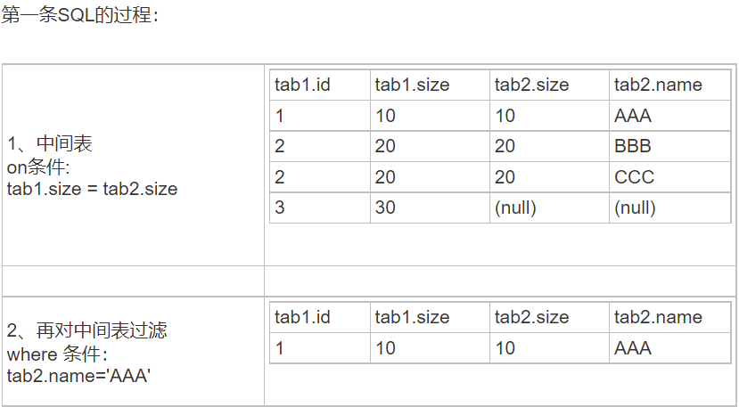
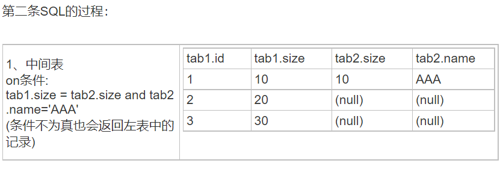

### 多表

- 一对一：用户user(id,cid) 身份证card(id,number):cid -> id

- 一对多：用户user(id,dept_id) 部门dept(id，name):用户(n) -> 部门(1) 一个部门可以有多个用户

- 多对多：中间表,用户user(id) 课程class(id) 中间表t_user_class(uid,cid)

### 多表查询

- 内连接(隐式)

```sql
SELECT * FROM user,dept WHERE user.dept_id = dept.id;
```

- 内连接(显式)

```sql
select 字段列表 from 表名1 [inner] join 表名2 on 条件
```

- 外链接查询(左(右)外连接)

```sql
select 字段列表 from 表1 left(right) [outer] join 表2 on 条件
```

- 子查询(查询中嵌套查询)

```sql
-- 查询工资最高的员工信息
-- 1 查询最高的工资是多少 9000
SELECT MAX(salary) FROM emp;
-- 2 查询员工信息，并且工资等于9000的
SELECT * FROM emp WHERE emp.`salary` = 9000;
-- 一条sql就完成这个操作。子查询
SELECT * FROM emp WHERE emp.`salary` = (SELECT MAX(salary) FROM emp);
```

- 子查询的三种情况

```sql
1. 子查询的结果是单行单列的：
    -- 查询员工工资小于平均工资的人
    SELECT * FROM emp WHERE emp.salary < (SELECT AVG(salary) FROM emp);
2. 子查询的结果是多行单列的：
    -- 查询'财务部'和'市场部'所有的员工信息
    SELECT id FROM dept WHERE NAME = '财务部' OR NAME = '市场部';
    SELECT * FROM emp WHERE dept_id = 3 OR dept_id = 2;
    -- 子查询
    SELECT * FROM emp WHERE dept_id IN (SELECT id FROM dept WHERE NAME = '财务部' OR NAME = '市场部');
3. 子查询的结果是多行多列的：
    -- 子查询可以作为一张虚拟表参与查询
    -- 查询员工入职日期是2020-11-11日之后的员工信息和部门信息
    -- 子查询
    SELECT * FROM dept t1 ,(SELECT * FROM emp WHERE emp.`join_date` > '2020-11-11') t2
    WHERE t1.id = t2.dept_id;
    -- 当然也可以用内连接
    SELECT * FROM emp t1,dept t2 WHERE t1.`dept_id` = t2.`id` AND t1.`join_date` >  '2020-11-11'
```

### 内部查询

- 正在做一个UPDATE/INSERT/DELETE操作时，不能引用在内部查询表(可以但是从外部表引用一个字段)

```sql
1.
UPDATE tablea
SET TIME =
(
    SELECT MAX(TIME)
    FROM tablea # 这是错的
)
WHERE ID = 1;
2.
UPDATE mytable
SET TIME =
(
    SELECT * FROM (
    SELECT MAX(TIME)
    FROM mytable)
    AS tableb    # 这会导致将必需的字段隐式复制到临时表tableb中，因此是允许的
)
WHERE ID = 1;

```

### JOIN中on与where的区别

数据库在通过连接两张或多张表来返回记录时，都会生成一张中间的临时表，然后再将这张临时表返回给用户

- 在使用left join时，on和where条件的区别如下

    - on条件是在生成临时表时使用的条件，它不管on中的条件是否为真，都会返回左边表中的记录
    - where条件是在临时表生成好后，再对临时表进行过滤的条件

tab1:

|id|size|
|---|---|
|1	|10|
|2	|20|
|3	|30|

tab2:

|size|name|
|---|---|
|10	|AAA|
|20	|BBB|
|20	|CCC|

> select * from tab1 join tab2(返回的是3 * 3行数据)
> 
> select * from tab1 left join tab2 on (tab1.size = tab2.size) where tab2.name='AAA'
>
> select * from tab1 left join tab2 on (tab1.size = tab2.size and tab2.name='AAA')





原因就是left join、right join、full join的特殊性，不管on上的条件是否为真都会返回left或right表中的记录，full则具有left和right的特性的并集。而inner join没这个特殊性，条件放在on中where中，返回的结果集是相同的

```sql
select * from student s, class c where s.cid = c.id and s.id = 1
-- 先写表的关联关系，再写判断
select * from user u,course c,user_course uc where u.id = uc.uid and c.id = uc.cid and u.id = 1
一般不用left join、right join 直接用where隐式内连接就可以
```
