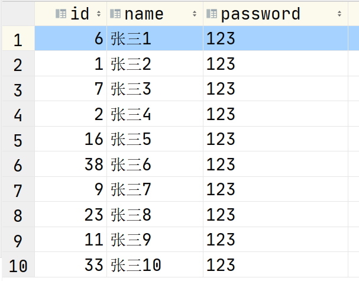
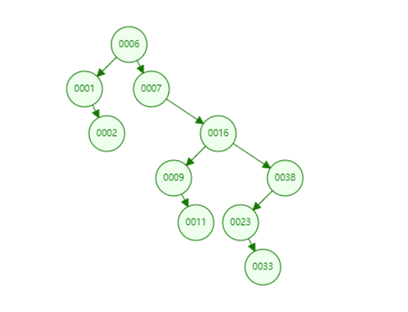
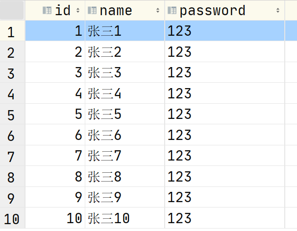
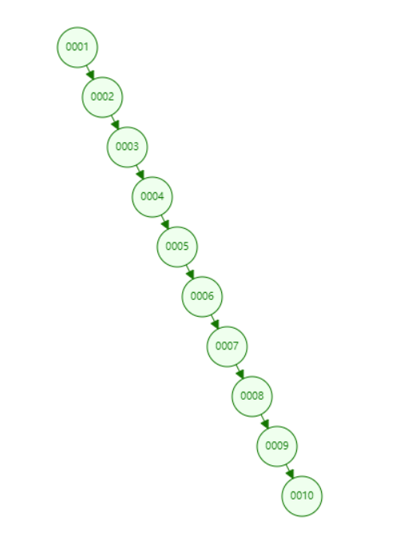
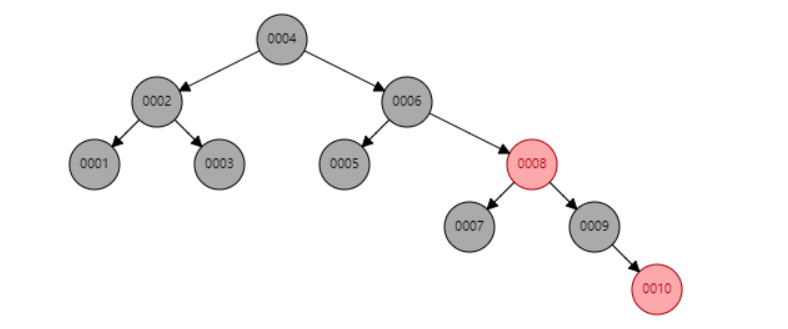
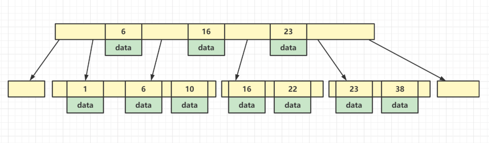
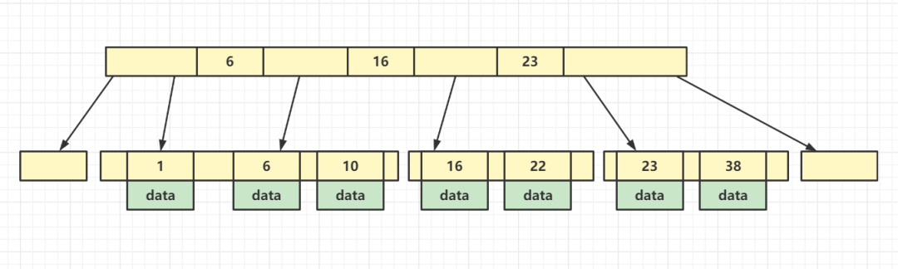

### 索引

> 索引就是帮助数据库快速查询数据的数据结构，说白了，索引就是一种数据结构

现在要查询 id = 11 的数据，SQL 语句为：select * from user where id = 11

这个时候，需要逐行遍历，直到找到 id = 11 的那行数据，而 MySQL 的数据都是存储在磁盘中的，而非缓存，所以效率就比较低，每查询一行都要去磁盘上查找，由上图我们可以得知，找到 id = 11 的数据，需要查找 9 次，这是在没有索引的情况下。

现在我们给 id 添加索引，所谓的添加索引，是指在存储数据的同时去维护一个存储了 id 值的数据结构，比如二叉树，即把 id 的值存到二叉树中，按表中的数据则会形成下列二叉树。

在这棵二叉树中查询 id = 11 的值，只需要 5 次即可找到，这就是索引提高查询速度的原理。

索引树中存储的是 key-value 结构的数据，key 就是索引的值，即 11，而 value 则是 id = 11 这一行数据在磁盘中的地址，所以查找的顺序是先找到索引对应的 key 值，从而获取到 value 值，也就是数据行的地址，进而就可以直接获取到数据行了，只需要读取一次磁盘即可，速度就快了很多倍，大大提升了效率。

MySQL 索引底层其实用的并不是二叉树，因为二叉树还不够优化，面对海量数据的时候，它的效率还是远远不够的，关于二叉树的性能劣势，通过下面这个例子你就清清楚楚了，比如，现在的数据如下所示。

此时我们查询 id = 10 的数据，如果把索引存入二叉树，则二叉树结构如下所示

这样的二叉树其实就是一个链表，则查找 id = 10 的数据，依然要查找 10 次，效率非常低，和不建索引直接逐行查找没有什么区别，所以单纯使用二叉树，肯定是不合适的。

如果用红黑树呢:红黑树本身就是一个平衡二叉树，可以避免二叉树退化成链表的情况，我们现在用红黑树来生成上述的索引，如下图所示

再次查找 id = 10 的数据，只需要查找 5 次即可找到

但是当数据量很大的时候，比如千万级别，此时的红黑树虽然可以保持平衡，但是树的高度会非常大，查询数据同样需要遍历很多层，在海量数据的情况下，速度依然难以到达我们的要求

解决方法只有一个，就是横向扩展，在同一层上存储多个节点，如下图所示

这样就可以限制树高度的同时，存储大量数据，这种结构就是 B 树，如下图所示

比如现在要查询 id = 7 的数据，先在树的第一层查找，发现没有 id = 7 的索引，但是发现它在 6-16 之间，则通过 6-16 之间存储的地址找到第二层大于 6  的区域，然后从在这个区域中很快可以找到 id = 7 的数据，这种方式类似于折半查找法

到这还没完，MySQL 索引所采用的数据结构并不是 B 树，而是对B 树又进行了一次优化，把 data 值全部存储到叶子节点，即非叶子节点不存储 data，只存储索引的值，如下所示

这样修改的好处是什么呢？我们知道树的每一层存储空间都是有限的，大概是 16 KB，那么如果在这存储 data，每一个元素所占用的空间就更大，所存储的元素个数就越少。

如果把 data 去掉，就意味着每一层可以存储更多的索引，从而降低树的高度，从另外一个角度来说，非叶子节点存储的都是冗余索引，即在它的下一层同样会记录这个索引值，也就是说非叶子节点存储的索引都是一些中间值，是用来分割的，把所有的数据按大小分割成一段一段的形式，再进行折半查找。

所以，真正的 B+ 树就是非叶子节点只存储索引值，叶子节点存储完整的索引值 + data，而这个 data 就是 MySQL 数据库中对应数据行的地址，通过 B+ 树的结构快速找到索引，进而获取 data，再读取到磁盘中的数据，这就是 MySQL 索引的底层数据结构，以及查找数据的原理。

这样的结构真的可以支持海量数据的快速检索吗？我们来推算一下，MySQL 分配给每一级的空间大小是 16 KB，非叶子节点的单位大小是 14 byte，那么可以计算出一层非叶子节点可以存储的索引个数大概是1170 个。叶子节点因为会存储 data，所占空间会大一些，大概是 1 KB，则一层叶子节点可以存储元素个数为 16。

那么如果是一棵树高为 3 的 B+ 树，两层非叶子节点，一层叶子节点，一共可以存储的索引个数为 1170*1170*16 = 2190W，你可以看到，仅需要一个 3 层高度的 B+ 树，就可以存储千万级别的数据量，同时查找速度也是非常快的。
